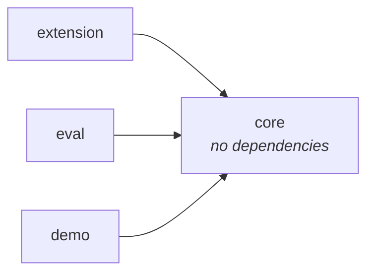
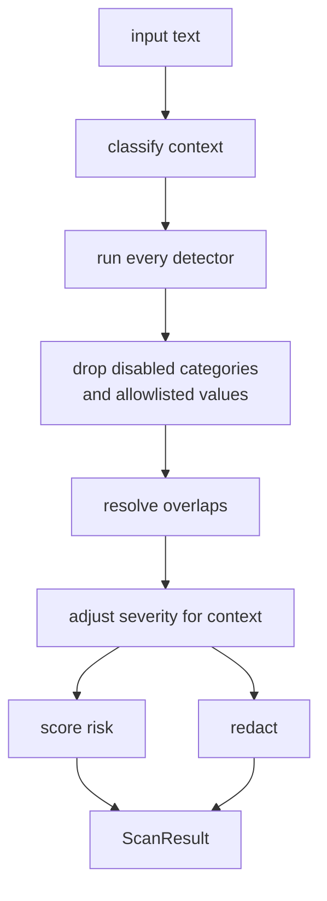
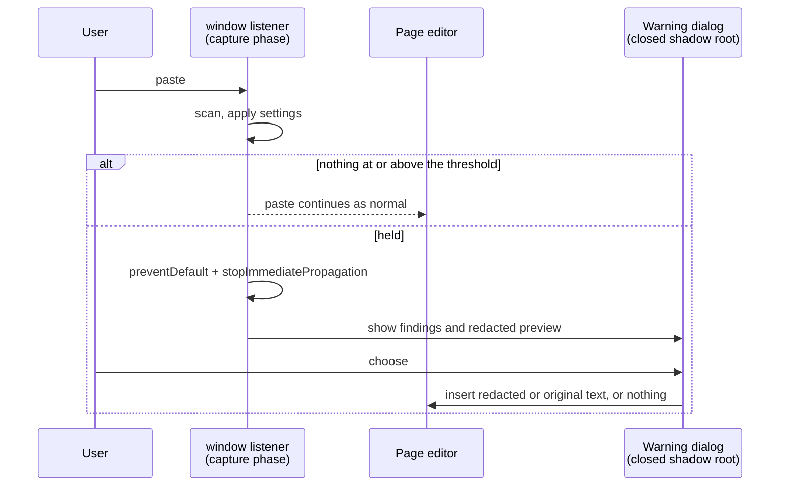

# Architecture

SafePrompt has two main parts: a scanner that decides what in a piece of text is
sensitive, and a browser extension that decides when to run it and what to do
with the answer. Most of the logic is in the scanner, and the scanner has no
knowledge of browsers.

## Packages

| Package                 | Contents                                                                        |
| ----------------------- | ------------------------------------------------------------------------------- |
| `@safeprompt/core`      | The scanner. TypeScript with no runtime dependencies and no I/O.                |
| `@safeprompt/extension` | The Chrome MV3 extension: paste handling, the warning dialog, settings.         |
| `@safeprompt/eval`      | Labelled test samples, the accuracy measurement and the benchmark.              |
| `@safeprompt/demo`      | A static web page that runs the scanner, so it can be tried without installing. |



The other packages depend on `core`, and `core` depends on nothing. This is
enforced in three places:

- pnpm only lets a package import what its own `package.json` declares, so
  `core` can't start using a library by accident.
- `core` is compiled without the DOM type definitions and without Node's types.
  Using `document`, `window`, `fetch`, `atob` or `Buffer` in it is a compile
  error.
- An ESLint `no-restricted-imports` rule stops `core` from importing other
  workspace packages, and stops other packages from importing anything in `core`
  except through `src/index.ts`.

The packages import each other's TypeScript source directly. `core` has no build
step of its own; Vite, Vitest and `tsx` compile it wherever it is used, so
changes to it show up in the other packages straight away.

## Scanning

Everything goes through `scanText(input, options)`. It is synchronous and has no
side effects, so the same input and options always produce the same result.



### Findings

A `Finding` describes one piece of sensitive content: which detector found it,
what kind of thing it is, how serious it is, how confident the detector is, and
a list of reasons (`evidence`). It stores the position of the match in the
input, but not the matched text itself. Code that needs the value reads it out
of the input using that position. Because findings never contain the secret,
they can be counted, logged and stored safely, which is what allows the
extension to keep a history.

### Detectors

Each detector lives in its own file with its own tests, and is registered in
`detectors/index.ts`.

| Detector              | Severity | How it works                                                                       |
| --------------------- | -------- | ---------------------------------------------------------------------------------- |
| `private-key`         | critical | A PEM block whose `END` line names the same key type as its `BEGIN` line           |
| `database-url`        | critical | Parses the connection string into user, password, host and database name           |
| `cloud-token`         | varies   | Known prefixes and lengths for AWS, GitHub, Stripe, Slack and OpenAI keys          |
| `jwt`                 | high     | Decodes the header and checks it is JSON with an `alg` field                       |
| `password-assignment` | high     | A value assigned to a name containing `password`, `secret`, `api_key` and so on    |
| `private-ip`          | medium   | Checks each octet is in range, then compares against private and link-local ranges |
| `internal-hostname`   | medium   | Reserved suffixes like `.internal` and `.corp`, and Kubernetes service addresses   |
| `email`               | low      | Address format, excluding documentation domains and credentials inside URLs        |

Most detectors use a regular expression to find candidates and then check the
candidate's structure: decoding the JWT header, parsing the connection string,
checking the IP octets. The structural check is what keeps the false positive
rate down.

Values that come from free text also go through a shared filter
(`detectors/shared/placeholders.ts`). It recognises template syntax such as
`${DB_PASSWORD}`, references like `process.env.API_KEY`, example keys from
vendor documentation, and dummy values like `xxxxxxxx`. Documentation is full of
these, and the filter is the reason a pasted README produces no findings.

### Overlapping findings

Detectors run independently, so a single `postgres://user:pw@host/db` is matched
by the connection string, password and hostname detectors at the same time.
Redacting all three would mangle the output. `resolveOverlaps` keeps a set of
findings that don't overlap: the higher severity wins, then the longer span,
then the one that starts first, and finally the detector id so that the result
never depends on the order detectors are registered in. The finding that wins
records which other detectors also matched, so the warning can still mention
that a connection string contained a password.

The accepted findings are kept sorted by position and never overlap each other,
so a new candidate only needs to be compared with its neighbours, which are
found with a binary search. The first version compared each candidate with every
accepted finding. That version is still in the property tests, and the current
one has to give identical results.

### Context

`classifyContext` guesses whether the input is JSON, an env file, a stack trace,
SQL, a log, source code or plain text. JSON is detected by trying to parse it.
The others are detected by looking at what fraction of the lines match a
pattern, checking the most specific types first, since a stack trace also
contains lines of code.

Context can raise a finding's severity but never lower it. Personal data and
infrastructure details found in a log or a stack trace are treated as more
serious than the same values in plain text. Lowering severity based on a guess
would mean occasionally missing a real leak, which is worse for this tool than
an extra warning. Each adjustment is added to the finding's evidence.

### Risk score

Each finding adds points based on its severity: 4 for low, 12 for medium, 30 for
high and 60 for critical. Repeated findings from the same detector at the same
severity are worth 0.6 times the previous one, so twenty email addresses don't
count as twenty separate problems. The total is mapped to a level (medium from
15, high from 35, critical from 70), and the final level is whichever is higher:
that level, or the severity of the worst single finding. The first rule lets
several medium findings add up to high. The second makes sure a single private
key is reported as critical even though its 60 points are below 70.

### Redaction

`redact` replaces each finding with a placeholder in one pass from left to
right, so earlier replacements can't shift the positions of later ones.
Placeholders are numbered per value within each type: the same email address
becomes `[EMAIL_1]` every time it appears, and a different one becomes
`[EMAIL_2]`. This keeps the text useful, because an assistant can still tell
which address or host is which. Connection strings are redacted one part at a
time so their structure is kept:

```
postgres://[DB_USER_1]:[DB_PASSWORD_1]@[DB_HOST_1]:5432/[DB_NAME_1]
```

`rehydrate` does the reverse and puts the original values back, for example into
an assistant's reply.

## The extension



### Catching the paste

The paste listener is added to `window` in the capture phase, from a content
script that runs at `document_start`, before any of the page's own scripts. That
puts it ahead of any listener the page or its editor adds.

Calling `preventDefault()` isn't enough to stop a paste on these sites.
ProseMirror, the editor ChatGPT and Claude use, reads the clipboard in its own
paste handler and inserts the text even if the event was cancelled. So when a
paste is held, the listener also calls `stopImmediatePropagation()` and the
editor never receives the event.

### Site adapters

Each supported site has an adapter. It matches the page's hostname against an
exact list (so `chatgpt.com.evil.test` isn't treated as ChatGPT) and checks that
the paste is going into the message box. Pastes into search fields or settings
forms are ignored. The code that inserts text is shared between the adapters,
because all three sites accept text in one of two ways:

- Rich text editors get text through `document.execCommand('insertText')`. The
  function is deprecated, but it is still the only way to insert text through
  the browser's own editing path, so the editor receives the
  `beforeinput`/`input` events it expects and updates its own state. Changing
  the DOM directly leaves the editor's state out of sync, and the text vanishes
  the next time it re-renders.
- Textareas get text through the native `value` setter on the element's
  prototype, followed by an `input` event. This is needed for React-controlled
  fields to pick up the change.

Opening the warning dialog moves focus away from the editor and loses the
cursor position, so the selection is saved during the paste event and restored
before inserting.

### Failing open

The sites can change their editors at any time, which would break an adapter.
All adapter code is wrapped by `failOpen`, and the paste is only cancelled once
everything that could throw has succeeded. If an adapter breaks, the paste goes
through as normal.

This has a cost: after a site redesign, pastes on that site aren't checked until
the adapter is updated, and the user isn't told. The alternative would be
blocking or losing people's pastes, and they would uninstall the extension.

### The warning dialog

The dialog is rendered inside a closed shadow root. Page scripts get `null` when
they read `element.shadowRoot`, so they can't read the redacted preview, and the
page's CSS can't restyle the buttons. A page that could make "Paste original"
look like "Cancel" would be a real problem. Events from inside the dialog are
stopped at the shadow host, so the page's click tracking doesn't see which
button was pressed.

Escape and clicking outside the dialog both cancel. The dialog takes focus when
it opens and keeps Tab inside itself, so typing can't reach the editor behind
it.

### Settings and history

Settings are validated with zod one field at a time. If a stored value is
missing or invalid, only that field falls back to its default and the rest of
the user's settings are kept. The content script reads settings from an
in-memory cache that starts with the defaults (protection on) and is updated
when storage responds, because the decision about a paste has to be made before
storage could answer.

Both settings and history are kept in `chrome.storage.local`. Chrome's `sync`
storage was used at first, but it would copy the allowlist to every device
signed in to the user's Google account, and allowlist entries can be sensitive.

History records what kind of thing was found, on which site, and what the user
chose. It never records the pasted text. The site is stored as the adapter's
name rather than the page URL, because conversation URLs contain their own
identifiers. Only the latest 200 entries are kept.

## Testing and measurement

### Accuracy

`pnpm eval` scores each detector against 49 labelled samples. 23 contain secrets,
and 26 contain text chosen because it looks like secrets: README setup blocks,
git logs, UUIDs, lockfile hashes and minified JavaScript. Detectors are scored
on their own output rather than through the full pipeline, so one detector's
numbers aren't affected by another one winning an overlap. The results are
written to [EVALUATION.md](EVALUATION.md). CI fails if precision, recall or
context classification accuracy drop below the committed baseline, or if the
committed report doesn't match what `pnpm eval` produces.

### Performance

`pnpm bench` times scans of realistic text from 1 KB to 1 MB, plus inputs
designed to make regular expressions backtrack, and fails if any median time
goes over its limit. On a laptop, a typical 10 KB paste takes about 2 ms and
1 MB takes about 140 ms. The limits in CI are several times higher than that to
allow for slower machines.

The first time the benchmark ran, it didn't finish. Two detectors took time
proportional to the square of the input length on long runs of letters, because
a match could start at any character and each attempt scanned to the end of the
run. Overlap resolution was also quadratic in the number of findings. A 1 MB
paste took over a second, and 100 KB of letters with no spaces would have
frozen the tab for around 16 seconds. The patterns now only start matching at
the beginning of a run, and the slow inputs stay in the benchmark so the problem
can't come back unnoticed.

### Tests

Unit tests are next to the code they test. Redaction and overlap resolution also
have property-based tests using fast-check, which check that:

- redacting and then rehydrating gives back the original text
- text outside the findings is unchanged
- each finding is replaced with a placeholder of its own type
- resolution never leaves overlapping findings, and only drops a finding when it
  overlaps one that was kept

To check that the tests actually catch bugs, I broke the code on purpose and ran
them. This showed that a bug in placeholder numbering went undetected, because
the random inputs almost never produced the case that triggers it. The
generators now favour short findings and repetitive text.

## Design decisions

- The scanner has its own package with no dependencies. It's the part that
  matters most for security, so it needs to be possible to test, benchmark and
  read it without a browser. The downside is writing some things by hand; `core`
  has its own base64url decoder because `atob` is only in the DOM type
  definitions and `Buffer` is only in Node's.
- Packages use each other's source instead of TypeScript project
  references. Project references help when builds are slow. With four small
  packages they would only add a build step and a `dist/` folder that can get
  out of date.
- TypeScript is pinned to 6.x. `typescript-eslint` doesn't support
  TypeScript 7 yet, and without it the type-aware lint rules stop running,
  including the ones that keep the packages separate. The pin is also a pnpm
  override, so a dependency can't pull in version 7 either.
- Structure checks on top of regular expressions. A regular expression finds
  candidates, and parsing or validation decides whether they count.
- Only pastes are checked. Typing, drag and drop and file uploads aren't. A
  paste is a single event with the whole text available at once, which makes it
  practical to check before anything is sent.
- The default threshold is medium. A single email address in plain text is
  let through, but the same address in a log is raised to medium and held.
  Stopping every paste that contains an email address would train people to
  click through the warning without reading it.
- Allowlist entries use `*` wildcards instead of regular expressions. Users
  can't write a slow regular expression by mistake, and each pattern must have
  at least four characters besides `*` so that `*` on its own can't turn the
  scanner off.
