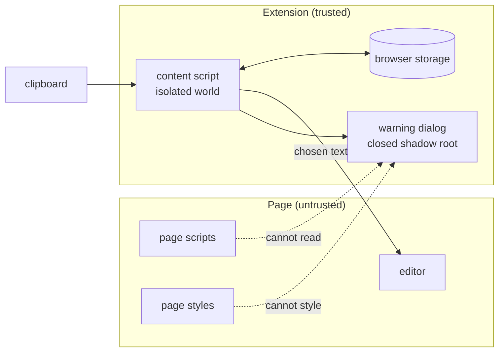

# Threat model

## What SafePrompt is for

People often paste things into AI assistants without reading them closely first:
a config file, a stack trace, part of a log. That text can include API keys,
database passwords, internal hostnames and customers' email addresses.
SafePrompt checks the paste before it reaches the site and offers a redacted
version.

The main risk SafePrompt deals with is the user's own mistake rather than an
attacker. That affects most of the decisions below. The warnings have to be
accurate enough that people trust them, and rare enough that people leave the
extension turned on.

## What needs protecting

| Asset                             | Where it is                                                |
| --------------------------------- | ---------------------------------------------------------- |
| The text being pasted             | The clipboard, then the extension's memory during one scan |
| The redacted preview              | The warning dialog, inside a closed shadow root            |
| The original text                 | Memory, until the user makes a choice, then discarded      |
| Settings, including the allowlist | `chrome.storage.local`                                     |
| Paste history (no text)           | `chrome.storage.local`                                     |

## Trust boundaries

The page is treated as untrusted, including its scripts, its styles and its
editor. The content script runs in Chrome's isolated world. It can see the
page's DOM, but it has its own JavaScript environment, so the page can't read
its variables or replace its functions. The extension doesn't make any network
requests.

## Threats and how they are handled

| Threat                                                                    | How it is handled                                                                                                                 |
| ------------------------------------------------------------------------- | --------------------------------------------------------------------------------------------------------------------------------- |
| The user pastes a secret into an assistant                                | Pastes into a supported message box are scanned, and anything at or above the chosen threshold is held until the user decides     |
| The editor inserts the paste even though the extension cancelled it       | A held paste also has its propagation stopped. The listener is on `window` in the capture phase and is added at `document_start`  |
| A page script reads the redacted preview or the original text             | The dialog is in a closed shadow root, and the content script's variables are in the isolated world                               |
| Page CSS makes "Paste original" look like "Cancel"                        | The page's styles don't apply inside the shadow root, and the host element resets inherited styles with `all: initial !important` |
| The page's analytics record which button the user clicked                 | Events from the dialog are stopped at the shadow host                                                                             |
| A large paste freezes the tab                                             | Detector patterns run in linear time. The CI benchmark includes inputs designed to make regular expressions backtrack             |
| A broken adapter loses the user's paste                                   | Adapter code fails open. A paste is only cancelled after everything that could throw has succeeded                                |
| A lookalike domain is treated as a supported site                         | Adapters compare the hostname against an exact list                                                                               |
| The history ends up containing secrets                                    | History stores detector names, counts, severity and the user's choice, but never text or URLs                                     |
| Corrupted settings turn protection off                                    | Each setting is validated separately and falls back to its default, and the defaults have protection on                           |
| An allowlist entry like `*` switches scanning off without anyone noticing | Patterns need at least four characters besides `*`. Anything broader is ignored and flagged on the settings page                  |
| A compromised dependency                                                  | The lockfile is committed and CI installs with `--frozen-lockfile`. Dependency install scripts are blocked except for esbuild's   |

## What SafePrompt does not protect against

- Anything other than pasting. Typed text, drag and drop, file uploads and
  screenshots are not checked.
- Sites other than ChatGPT, Claude and Gemini. Pastes anywhere else are not seen.
- Site redesigns. The adapters depend on how each site's page is built. If a
  site changes its editor, pastes there go through without being checked until
  the adapter is updated, and the user is not told.
- Secrets that no detector recognises. [ARCHITECTURE.md](ARCHITECTURE.md) lists
  the formats that are covered. A token format with no recognisable prefix,
  pasted without a name like `password` or `api_key` next to it, will be missed.
  Recall on the test samples is 98.3%, and it will be lower on real text.
- The user choosing "Paste original". SafePrompt shows what it found, but the
  decision is the user's.
- Page listeners in the capture phase. Events from the dialog are stopped as they
  bubble up, so a page listening in the capture phase can still tell that a
  click happened on the extension's element. It can't tell which button was
  clicked or see any of the dialog's content.
- A compromised browser, or another extension with wider permissions. Those can
  read the clipboard and the page directly.
- Compliance requirements. SafePrompt is a safety net for individual users, not
  a data loss prevention system. Users can turn it off, and nothing is reported
  anywhere when they do.
